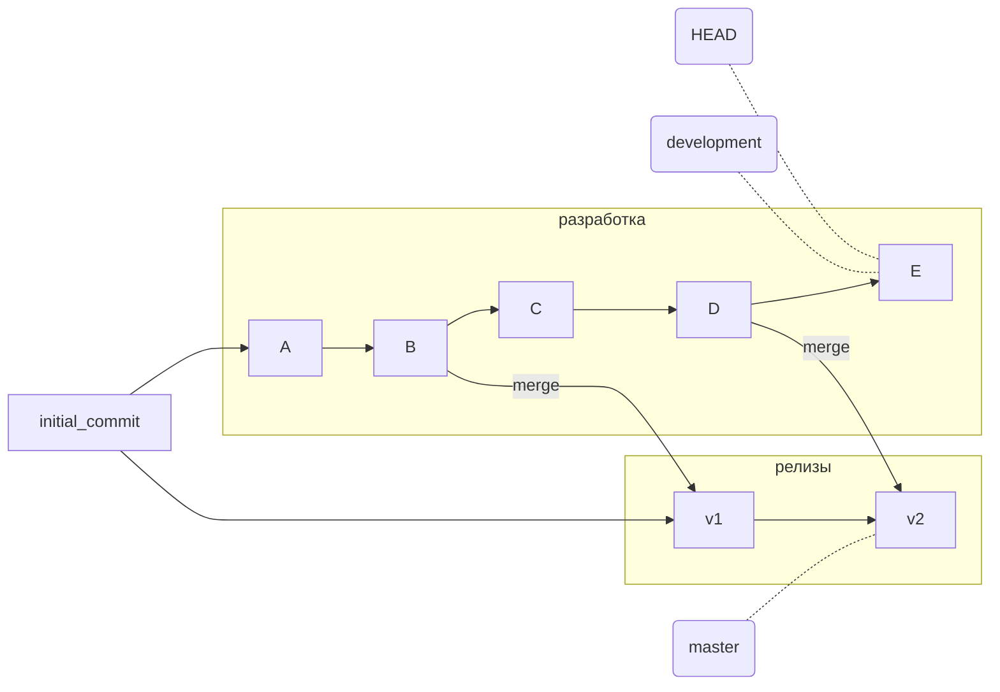
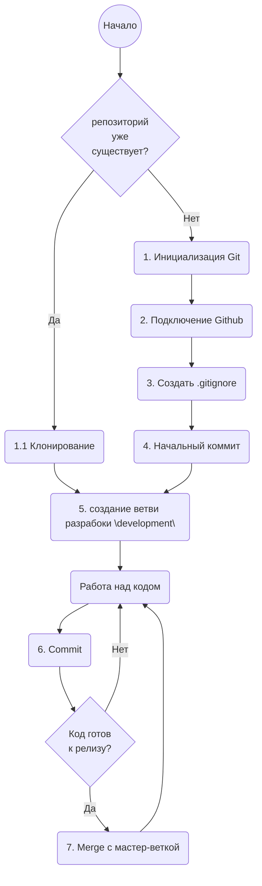

# Git для индивидуального проекта

Git используется практически везде в профессиональной разработке. Он позволяет совместно работать над одним проектом командам любого размера.

Нужен ли Git в индивидуальных проектах, когда разработчик всегда работает один, и нет необходимости интегрировать код, написанный другими программистами?

Что дает Git при использовании в индивидуальном проекте:

* Git в сочетании с облачным хранилищем таким как Github (есть и другие) обеспечивает безопасное и структурированное хранение кода. Вы не потеряете свои разработки при краже ноутбука или сбое жесткого диска
* в ходе разработки вы не боитесь что-нибудь сломать неудачными изменениями в самый неподходящий момент. С Git всегда можно откатиться на любую предыдущую стадию проекта
* вы можете создавать рабочие версии – релизы, непрерывно продолжая работу над разработкой
* у вас есть вся история проекта, вы не боитесь чистить код, удаляя куски, от которых вы отказались. Иногда бывает нужно вернуться к старым идеям, они все хранятся в истории проекта в git
* можно подключить к проекту других разработчиков, если потребуется
* Использование *github* легкий и удобный способ делиться своими разработками с другими людьми

Git - довольно сложный инструмент, с множеством команд и опций. В больших проектах часто существует специальная роль по интеграции и поддержке исходного кода. Индивидуальному разработчику или маленькой команде обычно нужно знать всего несколько команд и понимать основные принципы работы Git.

Разберем в этой статье, как можно работать одному разработчику в Git.

## Основные термины и понятия

### Что такое **коммит** (commit)?

В Git исходники храняться в виде последовательноси изменений или коммитов.

Cоздать **коммит**, значит зафиксировать изменения файлов в локальном репозитории.

Коммитом называется множество изменений, которые были внесены в файлы по отношению к предыдущему состоянию.
Каждый коммит содержить ссылку на коммит, который ему предшествовал. Таким образом можно отследить последовательность коммитов которые привели к текущему состоянию файлов. Последовательность коммитов можно представить в виде **ветки**. Для того чтобы выделить ветку достаточно указать на ее последний коммит.

### **Ветка** (branch)

Веткой в Git называется перемещаемый указатель на коммит.

В индивидуальной разработке я рекомендую поддерживать 2 ветки:

* Ветка с указателем **master** - основная ветвь в которой находится код в состояни, которое позволяет выдать его в "производство". Минимальные требования к нему это его корректность с точки зрения синтаксиса языка программирования. Этот код должен успешно собираться и запускаться на исполнение. Коммиты v1 и v2.
* Ветка с указателем **development** - рабочая ветка, где происходит разработка. Коммиты А, В, С, D, E на рисунке.

***



Метка **HEAD** всегда указывает на текущий последний коммит. То есть если мы находимся в ветке разработки, то HEAD == development.

Коммиты в ветке релизов v1 и v2 получаются путем операции **слияния** (merge)
При слиянии Git берет состояние файлов в ветке разработки (development) и пытается объединить с файлами в ветке релизов (master). Если в ветку мастер ничего не коммитилось помимо предыдущих слияний с веткой разработки, то эта операция очень простая и проходит автоматически. Если ветка мастер менялась независимо, например, там исправлялись ошибки помимо ветки разработки, то могут возникнуть конфликты. Их разрешение это отдельная тема.

## Последовательность шагов при работе в Git



### 1. Инициализация Git

В командной строке из рабочей папки вводим:

```bash
git init # создается папка .git в которой будет хранится локальная копия базы данных проекта
```

### 1.1 Клонирование

Если проект уже сущесвует в другой папке или на Github:

```bash
git clone https://github.com/vbasov007/my-git-guide.git  #создает папку my-git-guide с полной локальной копией репозитория. Формат команды git clone [path or url]  
```

### 2. Подключение Github

Открыть в браузере сайт [Github](github.com), создать новый проект и следовать инструкции по подключению нового репозитория.

```bash
git branch -M main # автоматически созданая ветка в git называется master, здесь ее можно переименовать в main. Это не обязательное действие, название main для главной ветки проекта принято на Github. По умолчанию главная ветка называется master
git remote add origin https://github.com/vbasov007/test.git # origin это псевдоним для url по которому находися удаленный репозиторий. Устанавливаем значение origin этой командой
git push -u origin main # синхронизация ветки main (или master) c удаленным репозиторием
```

### 3. Coздать .gitignore

По умолчанию git пытается включить все файлы из рабочего каталога. Это не желательно, поскольку в рабочем каталоге могут находится много файлов, которые не относятся к исходным кодам проекта. Например, служебные файлы с конфигурацией среды разработки, файлы для создания виртуального окружения, входные и выходные данные программ.

.gitignore - это простой текстовый файл, в каждой строке которого содержится шаблон файла или каталога, который необходимо проигнорировать

Пример содержимого .gitignore для проекта на Python:

```text
venv/
__pycache__/
*.py[cod]
*$py.class
*.log
.idea/
```

создайте файл в редакторе и сохраните в рабочей папке.
Имя файла ".gitignore" с точкой на первом месте.

### 4. Начальный коммит

Чтобы сделать коммит, нужно чтобы в дериктории были файлы. пустые директории git игнорирует. В проекте полезно иметь файл README.md где собрана информация о проекте

```bash
echo "# test" >> README.md # создание файла README.md
git init # инициализация локльного репозитория
git add README.md # добавляем файл README.md в индекс будущего коммита
git commit -m "first commit" # создаем начальный коммит
```

### 5. Создание ветки разработки (development)

Разработку лучше всего вести в отдельной ветке, для того чтобы не сломать уже работающий код и всегда иметь возможность выдать рабочий код независимо от состояния файлов в которых идет разработка.

```bash
git checkout -b development # создать новую ветку development (или другое имя).  Ключ -b говорит, что нужно сразу переключится на новую ветку. Если ветка с таким именем уже существуюет, то git просто переключится на существующую ветку.
```

## Часто необходимые действия

### Посмотреть текущий статус базы данных

```bash
git status # показать текущий статус папки, наличие изменений в папке, которые могут быть добалвены в коммит

git log # показать историю коммитов

gitk --all # запустить встроенный графический инструмент, показывающий все ветки и файлы в базе данных
```

### Удалить файл из кэша коммита

**Ситуация:** вы сделали "git add ." не заметив, что в рабочей папке есть файлы и папки, которые не должны попасть в базу.

```bash
git rm file.txt --cached # удалит файл file.txt из последнего добавления командой git add
git rm -r --cached . # удаляем все файлы добавленные в кэш коммита командой git add
```

После этого рекомендуеся добавить имена ненужных файлов/папок в .gitignore

### Откатить назад последний коммит

**Ситуация:** вы сделали "git commit" и поняли, что внесли ошибку или в коммит попали ненужные файлы.

```bash
git reset --soft HEAD~1 # удалить последний коммит, локальные файлы не меняются
```


