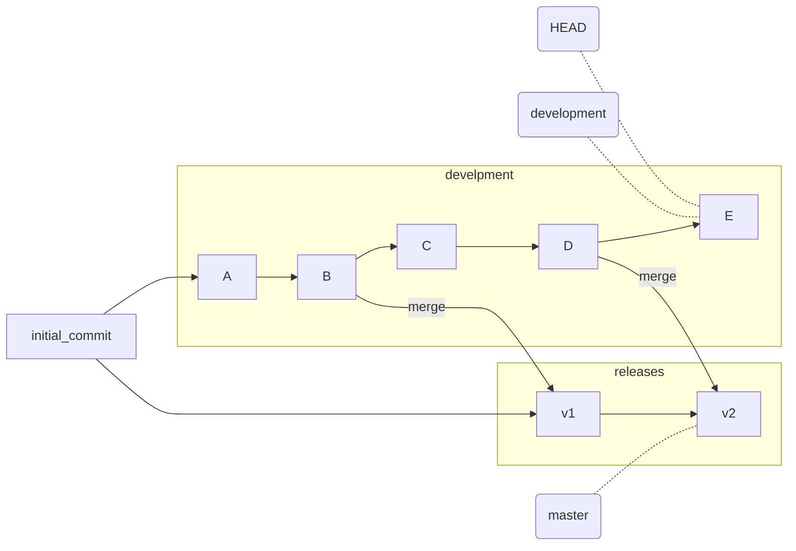
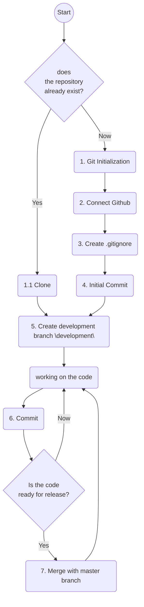

# Git for an individual project

Git is used almost everywhere in professional software development. It allows teams of any size to work together on the same project.

Is Git needed in individual projects when the developer always works alone and there is no need to integrate code written by other programmers?

What does Git give when used in an individual project:

* Git in combination with cloud storage such as Github (there are others) provides secure and structured code storage. You will not lose your developments if a laptop is stolen or a hard drive fails
* during development, you are not afraid to break something with unsuccessful changes at the most inopportune moment. With Git, you can always roll back to any previous stage of the project
* you can create working versions – releases, continuing to work on development
* you have the whole history of the project, don't be afraid to clean up the code by deleting the pieces you abandoned. Sometimes you need to go back to old ideas, they are all stored in the project history in git
* you can connect other developers to the project, if necessary
* Using *github* an easy and convenient way to share your developments with other people

Git is a rather complex tool, with a lot of commands and options. In large projects, there is often a special role for integration and source code support. An individual developer or a small team usually needs to know only a few commands and understand the basic principles of Git.

We will discuss in this article how a single developer can work in Git.

## Basic terms and concepts

### What is **commit** and **branch**?

In Git, the sources are stored as a sequence of changes or commits.

To create a **commit** means to commit changes to files in the local repository.

A commit is a set of changes that have been made to files in relation to the previous state.
Each commit contains a reference to the commit that preceded it. In this way, you can track the sequence of commits that led to the current state of the files. The commit sequence can be represented as a **branch**. In order to select a branch, it is enough to point to its last commit. In Git, a branch is a pointer to the last commit in the sequence.

In individual development, I recommend supporting 2 branches:

* Branch with the pointer **master** - the main branch in which the code is in a state that allows it to be issued to "production". The minimum requirements for it are its correctness from the point of view of the syntax of the programming language. This code must be successfully assembled and run for execution. See commits v1 and v2 on the figure.
* Branch with the pointer **development** - the working branch where development takes place. See commits A, B, C, D, E on the figure.

***



The **HEAD** label always indicates the current last commit. That is, if we are in the development branch, then HEAD == development.

Commits in the v1 and v2 release branch are obtained by the **merge** operation
When merging, Git takes the state of the files in the development branch and tries to merge with the files in the release branch (master). If nothing has been committed to the master branch in addition to previous merges with the development branch, then this operation is very simple and takes place automatically. If the master branch was changed independently, for example, errors were fixed there in addition to the development branch, then conflicts may arise. Their resolution is a separate topic.

## Sequence of steps when working in Git



### 1. Initialize Git

In the command line from the working folder, enter:

```bash
git init # creates a folder.git in which a local copy of the project database will be stored
```

### 1.1 Clone

If the project already exists in another folder or on Github:

```bash
git clone https://github.com/vbasov007/my-git-guide.git#creates a my-git-guide folder with a full local copy of the repository. Format of the git clone [path or url] command  
```

### 2. Github Connection

Open the [Github] website in the browser (github.com ), create a new project and follow the instructions for connecting a new repository.

```bash
git branch -M main # an automatically created branch in git is called master, here it can be renamed to main. This is not a mandatory action, the name main for the main branch of the project is accepted on Github. By default, the main branch is called master
git remote add origin https://github.com/vbasov007/test.git # origin is an alias for the url where the remote repository is located. Setting the origin value with this command
git push -u origin main # synchronization of the main (or master) branch with a remote repository
```

### 3. Create .gitignore

By default, git tries to include all files from the working directory. This is not desirable, because there may be many files in the working directory that do not belong to the source codes of the project. For example, service files with the configuration of the development environment, files for creating a virtual environment, input and output data of programs.

.gitignore is a simple text file, each line of which contains a file or directory template that must be ignored.

Sample content .gitignore for a Python project:

```text
venv/
__pycache__/
*.py[cod]
*$py.class
*.log
.idea/
```

create a file in the editor and save it in the working folder.
File name ".gitignore" with a dot in the first place.

### 4. Initial commit

To make a commit, you need to have files in the directory. git ignores empty directories. It is useful to have a file in the project README.md where information about the project is collected

```bash
echo "# test" >> README.md # creating a file README.md
git init # initializing the local repository
git add README.md # adding a file README.md to the index of the future commit
git commit -m "first commit" # creating an initial commit
``

### 5. Creating a development branch

It is best to develop in a separate branch, in order not to break the already working code and always be able to issue working code regardless of the state of the files in which the development is underway.

```bash
git checkout -b development # create a new development branch (or another name).  The -b key says that you need to switch to a new branch immediately. If a branch with that name already exists, then git will simply switch to an existing branch.
```

### 6. Commit

A commit is a commit of file changes in the git repository.

```bash
git status # we look at which files have been changed and can be included in the index, make sure that we are in the correct branch, edit if necessary.gitignore
git add . # adding all the changes to the commit
git commit -m "some comment" # creating a commit, be sure to write a comment to it
git push # sync with remote repository
```

### 7. Merge with the master branch

Merge or merge is an operation in which all changes from development are added to the master branch. If we work individually and nothing is committed to the master branch without us, then this is a very simple operation. If the master branch could be exposed by other project participants, then you need to act more carefully! This process is still outside the scope of this article.

Merge is called after the changes in the development branch are completed and a commit is made.

```bash
git checkout master # go to the master branch. We are making sure that the transition takes place. git will not allow you to switch to another branch if there are changes in the current one that are not saved. local files are replaced with the from state from the master branch
git merge development # start the merge operation, changes from development are integrated into master, a new commit will be created
git push # sync with remote repository
git checkout development # we return to the working branch to continue working on the project
```

## Frequently needed actions

### View the current status of the database

```bash
git status # show the current status of the folder, the presence of changes in the folder that can be added to the commit

git log # show commit history

gitk --all # run the built-in graphical tool showing all branches and files in the database
```

### Delete a file from the commit cache

**Situation:** you have done a "git add." without noticing that there are files and folders in the working folder that should not get into the database.

```bash
git rm file.txt --cached # will delete the file file.txt from the last addition by the git add command
git rm -r --cached . # delete all files added to the commit cache with the git add command
```

After that, it is recommended to add the names of unnecessary files/folders to .gitignore

### Roll back the last commit

**Situation:** you made a "git commit" and realized that you made a mistake or unnecessary files got into the commit.

```bash
git reset --soft HEAD~1 # delete last commit, local files don't change
``